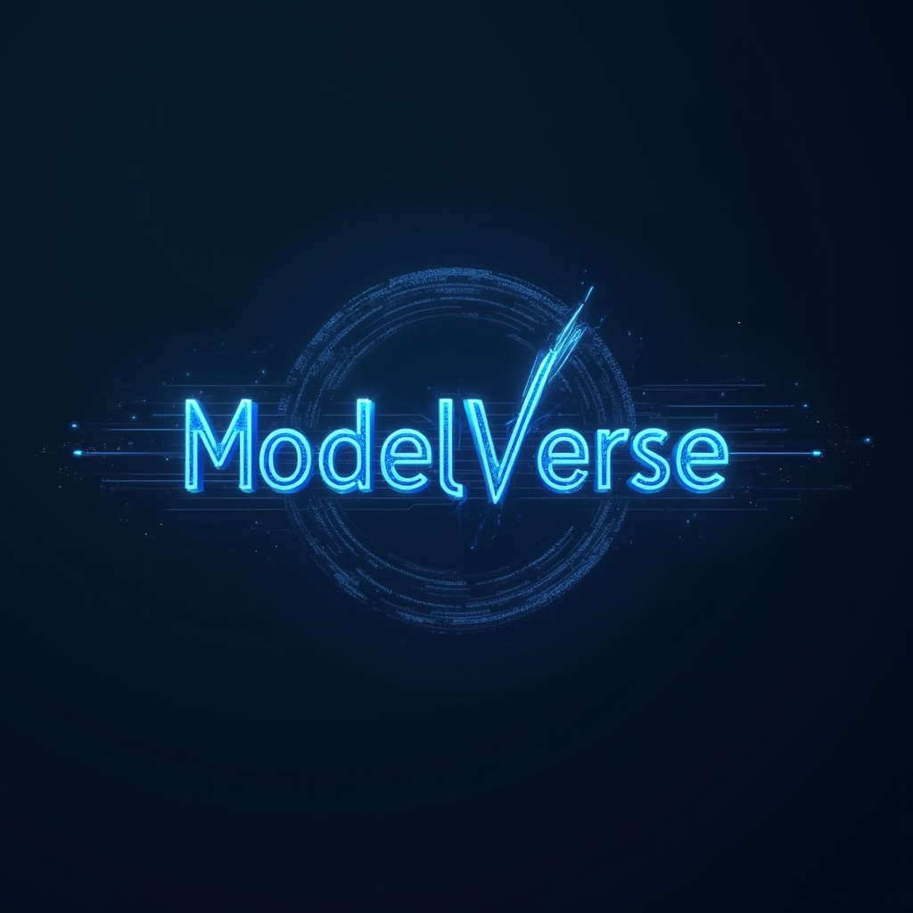
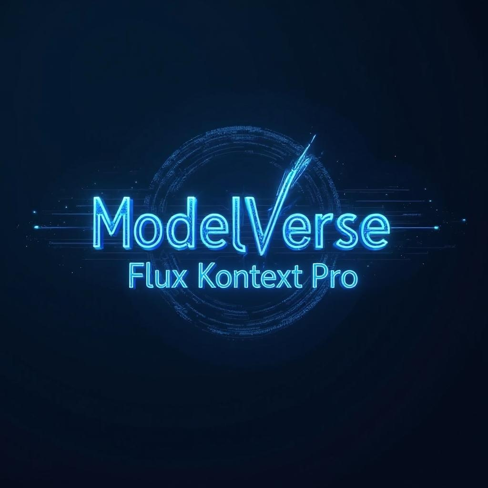
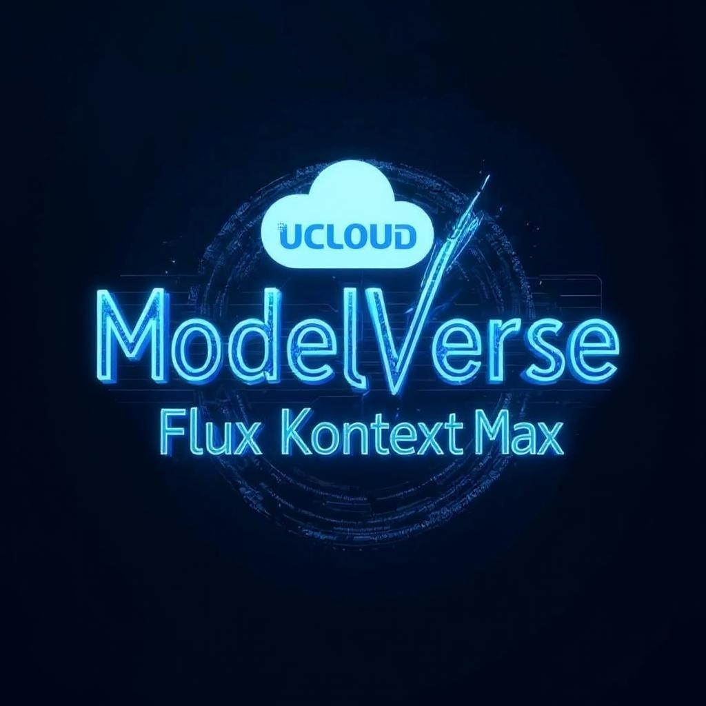
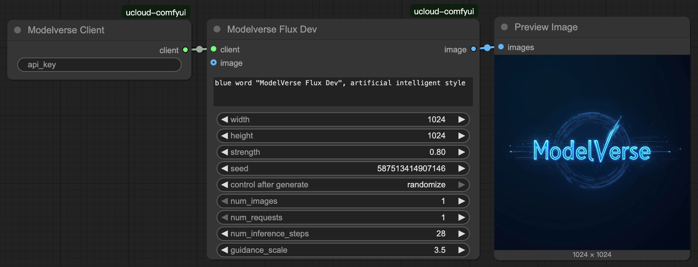
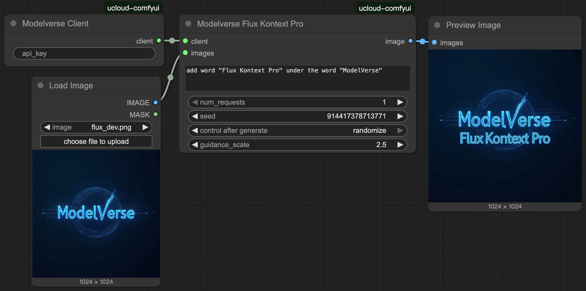
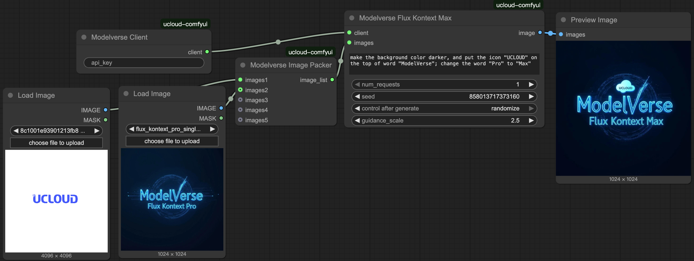

# UCloud ModelVerse API for ComfyUI

This plugin provides seamless integration with UCloud's ModelVerse API, enabling you to use powerful AI models directly within ComfyUI for image generation and editing tasks.

## Quick Start

### Installation

1. **Install via Custom Node Manager** (Recommended)
   - Open ComfyUI
   - Go to **Manager** → **Custom Nodes Manager**
   - Search for "ComfyUl-UCloud"
   - Click **Install**
   - Restart ComfyUI

2. **Configure API Key**
   
   - Get your API key: [Console En](https://console.ucloud-global.com/modelverse/experience/api-keys), [Console Zh](https://console.ucloud.cn/modelverse/experience/api-keys)
   - Add your UCloud ModelVerse API key in the `Modelverse Client` node
   - Alternatively, create a `config.ini` file with `MODELVERSE_API_KEY=your_api_key`

### Basic Usage

1. Add a `Modelverse Client` node to your workflow
2. Choose your desired model from the supported models below
3. Connect the appropriate input/output nodes
4. Run your workflow

## Supported Models

Our plugin supports the following models, each optimized for specific use cases:

- **Flux Dev** - Foundation model with strong stylization capabilities
- **Flux Kontext Pro Text2Image** - Specialized for text-to-image generation
- **Flux Kontext Pro** - Expert single image editing and enhancement
- **Flux Kontext Pro (Multi-inputs)** - Batch processing for multiple images
- **Flux Kontext Max Text2Image** - Premium text-to-image generation with highest quality
- **Flux Kontext Max** - Flagship single image editing with advanced features
- **Flux Kontext Max (Multi-inputs)** - Most powerful multi-image processing
- **Step1X-Edit** - Precision local editing and inpainting

Note: (Multi-inputs) models use the same node interface as their single-input counterparts. Check the example workflows below for implementation details.

## Example Workflows

Drag the following images into ComfyUI to automatically load example workflows:

    | Flux Dev | Flux Kontext Pro | Flux Kontext Max (Multi-inputs) |
    |:-:|:-:|:-:|
    |  |  |  |

    In case the above images does not work for you, check the screenshot below:

    Text-to-Image with Flux Dev
    

    Single image editting with Flux Kontext Pro
    

    Multi image editting with Flux Kontext Max
    

    